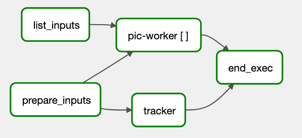

# PIC workflow on Apache Airflow
A workflow for space plasma physics on Apache Airflow. The workflow is implemented as a DAG, and can be run in Apache Airflow, on a Kubernetes cluster.

## Description
We provide a DAG to execute Particle-in-Cell simulation, using the [SputniPIC](https://github.com/KTH-HPC/sputniPIC) space plasma simulation software.



*The PIC DAG, as presented in the Apache Airflow UI*

## Quickstart

### Folders
The main DAG is contained in `pic.py`, we also provide with the following folders:
- `docker/` contains the `Dockerfile`, along with bash scripts which are included in the image;
- `misc/` contains various configuration files, used for testing and development;

### Installation checklist (see _Setup & Installation_)
- [ ] Kubernetes: PersistentVolume 
- [ ] Kubernetes: PersistentVolumeClaim with name `pv-pic`
- [ ] Docker: Docker image available in public registry with name `example/sputniPIC:latest`
- [ ] Apache Airflow: pic.py is in Apache Airflow's DAG folder. 
- [ ] DAG: in pic.py, `PVC_NAME` is set
- [ ] DAG: in pic.py, `IMAGE_NAME` is set
- [ ] DAG: one or more `.inp` simulation configuration files stored in the root of the PersitentVolume.

## Setup & Installation
### Requirements
- A Kubernetes cluster
- A working Apache Airflow setup: in particular, Apache Airflow must be configured to be able to run tasks on the Kubernetes cluster.

### 1. Kubernetes _PersistentVolume_ and _PersistentVolumeClaim_
The workflow relies on a specific PersitentVolumeClaim to be present on the Kubernetes cluster to store files during execution. In this step, we describe how to create a PersistentVolume, and a PersistentVolumeClaim attached to this volume.

**PersistentVolume**.
Your Kubernetes cluster administrator provides you with the name of the PersistentVolume you need to use.
However, if you manage your own Kubernetes cluster, you need to create a PersistentVolume yourself, we provide an example in `misc/pv.yaml`.
In this example, and in the rest of this tutorial, the PersistentVolume is named `pv-local`, and uses local storage as a backend. 
lease refer to Kubernetes documentation to learn more on PersistentVolume.
It can be deployed using:

```
kubectl create -f misc/pv.yaml
```

> [!NOTE]  
> Any other kind of storage other than local storage can be used as a backend for the PersistenVolume, depending on the Cloud provider.


**PersistentVolumeClaim**.
Once you know the name of the PersistentVolume (in this example `pv-local`), you need to create a PersistentVolumeClaim, containing information on the storage size.
An example is provided in `misc/pvclaim.yaml`, the PersistentVolumeClain can be cerated using:

```
kubectl create -f misc/pvc.yaml -n airflow
```

> [!WARNING]  
> It is crucial that the namespace used for the PVC is the same as the one under which the Apache Airflow is deployed, here we use `airflow`.

### 2. Building the Docker image
A Dockerfile is provided, along with scripts that will be included in the image, in the the `docker` folder.

To build and publish the image:
```
cd docker/
docker build -t gabinsc/sputnipic:latest
docker push gabinsc/sputnipic:latest
```

> [!NOTE]
> The image must be published to a public Docker registry, or a registry which is accessible from the Apache Airflow setup.
> Please refer to Docker documentation for more details on building an image, and publishing it.

### 3. Deploying and adapting the DAG
In order for the DAG to be executed in your specific environment, some adjusments are required.

1. Place the `pic.py` file in the DAG folder of your Apache Airflow setup.
2. Adjust the following constants in `pic.py`:
    - `IMAGE_NAME`: name of the image that will be used for the containers.
    - `PVC_NAME`: name of the PersistentVolumeClaim created in step 1, `pvc-pic`.
3. Validate that you can see the DAG under the name `pic` in the Apache Airflow UI. If not, DAG import errors are reported in the top of the UI.

## Run
Before you run the DAG, place the various configuration files for the simulation, in `.inp` format, in the root of the PersistentVolume defined in the Kubernetes cluster.

> [!NOTE]  
> Input files are available in SputniPIC's repository: [examples](https://github.com/KTH-HPC/sputniPIC/tree/main/inputfiles).

Click on "Trigger DAG" in the Apache Airlfow UI to start the DAG with the default parameters. You can customize the DAG parameters to your needs by clicking "Trigger DAG w/ config":
- `inputlist`: list of experiments, each experiement is the name of the corresponding configuration files, without the `.inp` extension.

## Relevant publications

## FAQ
